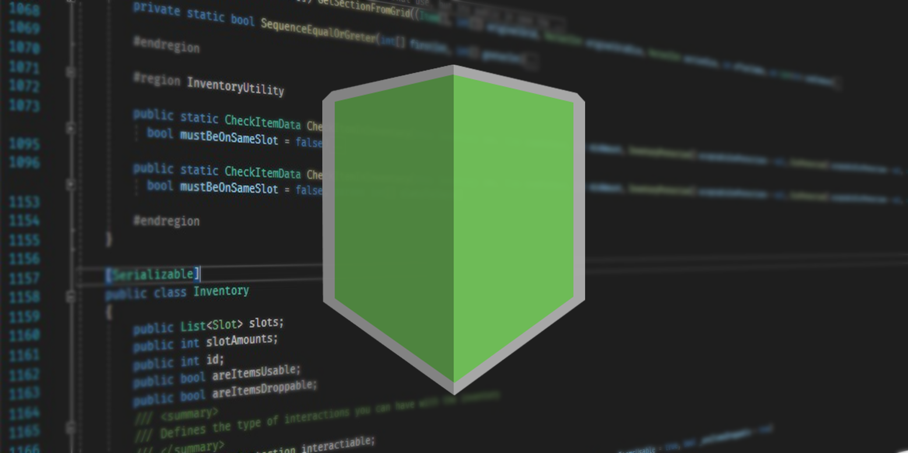
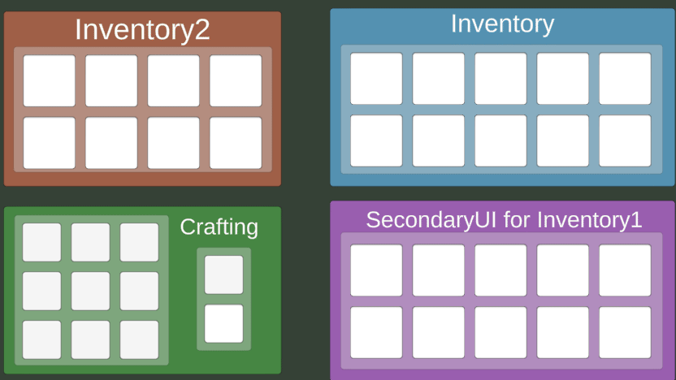

# Universal Inventory System  · [](https://github.com/Heymity/UniversalInventorySystem/blob/master/LICENSE) [](https://unity3d.com/get-unity/download/archive) [](https://github.com/Heymity/UniversalInventorySystem/releases)



## NOTE

This project is being recreated in the 'main' branch, if you wish to use the older but incomplete and currently unsupported version, change to branch 'legacy'. Branch 'v4' is mostly broken, though it has some advancements on the 'legacy' branch, still not recommended for anything.

Everything about the usage of the project in this file is, for now, FALSE, as it has not been implemented, but the goal is to make the project so that it resembles the legacy usage, which is showed here in this file.

## What is it?


The Universal Inventory System is a unity package for making advanced and higly customizable inventories in a easy way.

It's based on the idea of items as Scriptable Objects and an inventory controller to manipulate the inventories.

It also is open source and free to use, since it is under the [Apache-2.0 Licese](https://github.com/Heymity/UniversalInventorySystem/blob/Updating-README/LICENSE) wich grants you the permissions of:
<ul>
  <li>
    Commercial Use
  </li>
  <li>
    Modification, as long as the changes are documented
  </li>
  <li>
    Distribution
  </li>
  <li>
    Patent use, wich means you are provided an express grant of patent rights from contributors (Read item 3 of the license for more details)
  </li>
  <li>
    Private use
  </li>
</ul>

This license requires you to have a copy of the license in your software and to state the changes that you made, if you made any. I strongly suggest you to fork the repository, maintaining it public, and state the changes in the README file.


## Getting Started

You can see in more detail what is here by accesing our [documentation](https://heymity.github.io/UniversalInventorySystemDocs/)

To get started open in the InventorySystem/Example the ExampleScene. There you will find a four UI pf inventories, you can interact with them using the keys A, D, B, V to add items, I, E, O and C to toggle the inventories.



Now play with the values in the inspector and see how it goes.

### Coding

To code with this system, you will need to import it in your code with this line:

```c#
using UniversalInventorySystem;
```

Now you have access to all the functions from the UIS. To get started you can create an Inventory variable and initialize it. Make it public so you can see it in the inspector and understand what the InitializeInventory method does

```c#
using UniversalInventorySystem;
using UnityEngine;

public class MyInventory : MonoBehaviour {
    public Inventory myInv;

    public void Start() {
        myInv.slotAmounts = 10;
        myInv.InitializeInventory();
    }
}
```

If you use an InventoryUI you will not need to initialize it or set the amout of slots, the UI does all that for you. Now if you want to add an item, just use this code:

```c#
public Item item;

public void Update() {
    if (Input.GetKeyDown(KeyCode.W)) myInv.AddItem(item, 1);
}
```

You can create your own item by creating a new Item Asset in your project, or you can use one of the example ones.

Congrats! You have just made your first UIS Inventory.


